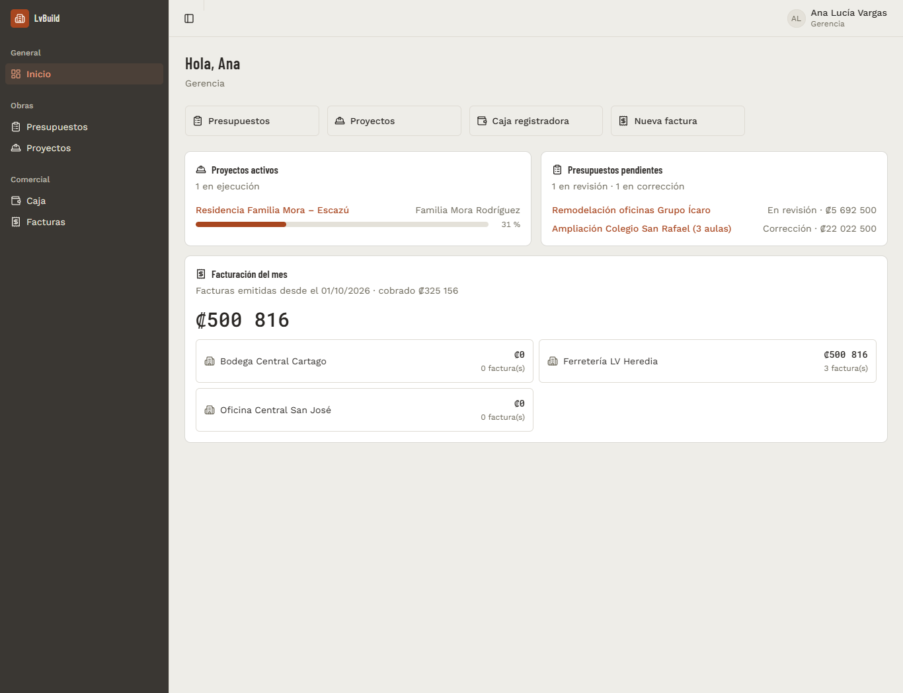
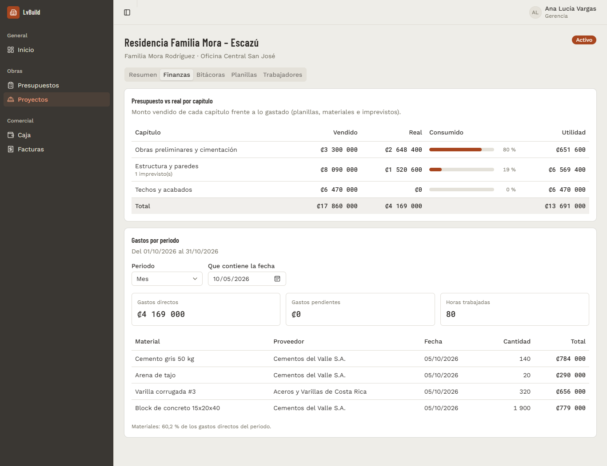
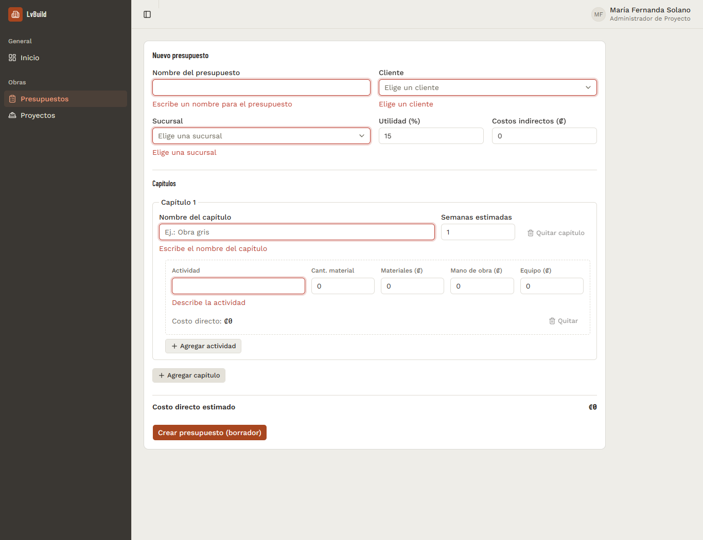
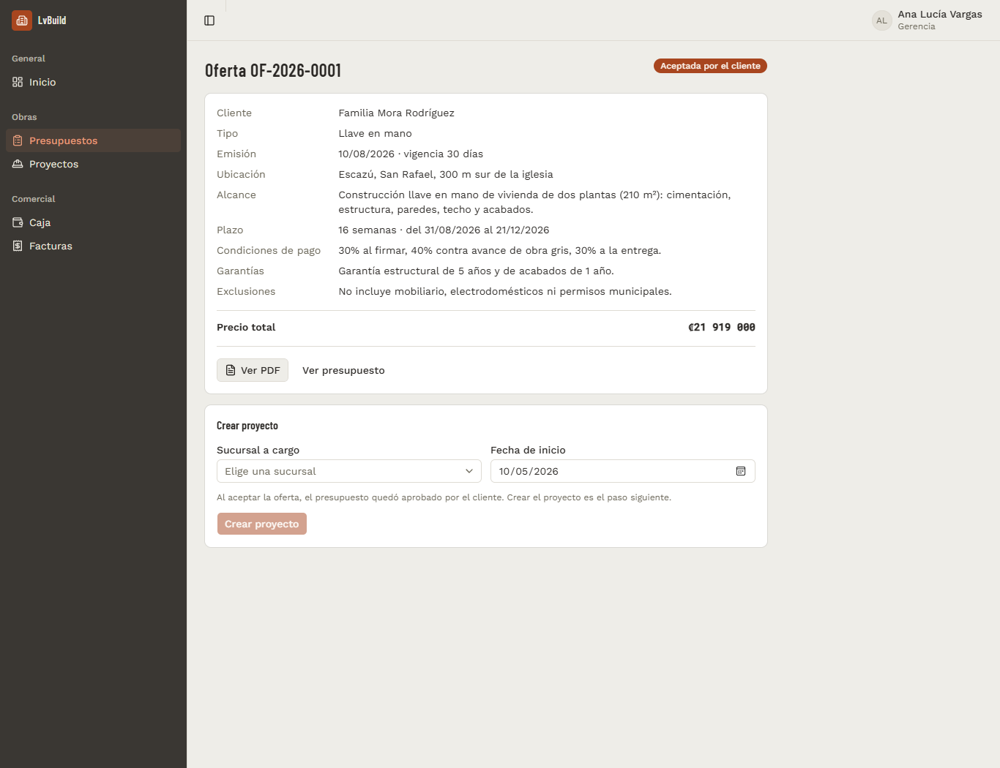
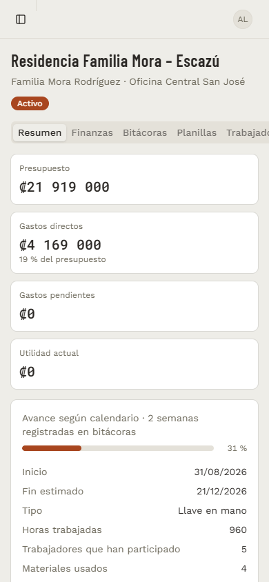

# LvBuild Web

[](https://github.com/LSvargas25/lvbuild-web/actions/workflows/ci.yml)


Frontend for **LvBuild**, the ERP of LV Construcciones (Costa Rica): budgets with an approval
workflow, client offers with PDF, projects with budget vs. actual, weekly site logs, payroll,
cash registers and invoicing. It talks to the [LvBuild API](https://github.com/LSvargas25/LvBuild)
(.NET 8 + PostgreSQL).

> **Resumen en español.** SPA en React 19 + Vite para el ERP de LV Construcciones: presupuestos
> con flujo de aprobación, ofertas en PDF, proyectos con presupuesto vs. real, bitácoras semanales,
> planillas, caja y facturación. La interfaz está en español de Costa Rica; el código y la
> documentación técnica, en inglés.



## Live demo

- **App:** https://lvbuild-web.onrender.com
- **API:** https://lvbuild-api.onrender.com ([Swagger](https://lvbuild-api.onrender.com/swagger), [health](https://lvbuild-api.onrender.com/health/ready)), source in [LvBuild](https://github.com/LSvargas25/LvBuild)

Both run on Render's free plan and sleep when idle: the first request after a while can take
30-60 seconds while the API wakes up.

### Demo credentials

Every demo user's password is **`LvBuild#2026`**.

| Email                      | Role                       | Try                                           |
|----------------------------|----------------------------|-----------------------------------------------|
| `gerencia@lvbuild.test`    | General Manager            | Approve budgets, accept offers, pay payroll   |
| `operaciones@lvbuild.test` | Operations Director        | Same approvals as the General Manager         |
| `proyectos@lvbuild.test`   | Project Admin              | Create budgets, offers and weekly site logs   |
| `sucursal@lvbuild.test`    | Branch Admin               | Open a cash register and invoice              |
| `comercial@lvbuild.test`   | Business Manager           | Cash register and invoicing                   |

## Screenshots

| Project finance: sold vs. actual per chapter | Budget form with inline validation |
|---|---|
|  |  |
| **Client offer** | **Phone** |
|  |  |

## Stack

| Concern        | Choice                                                                 |
|----------------|------------------------------------------------------------------------|
| UI             | React 19, TypeScript, Tailwind CSS v4, shadcn/ui on Base UI, lucide     |
| Routing        | React Router 7 (data router), one lazy chunk per screen                 |
| Server state   | TanStack Query 5                                                        |
| HTTP           | axios with a single-flight token refresh                                |
| Forms          | react-hook-form + zod                                                   |
| Tests          | Vitest, Testing Library, MSW                                            |
| Tooling        | Vite 8 (Rolldown), oxlint, GitHub Actions, Render (static site)         |

## Folder structure

```
src/
├── app/                 # App providers (React Query, auth, router, toaster)
├── components/          # Shared UI: EntitySelect, FormField, Pagination, PageHeader…
│   ├── layout/          # Sidebar + header shell
│   └── ui/              # shadcn/ui primitives (generated)
├── features/            # One folder per business module
│   ├── auth/            # Session context, login
│   ├── dashboard/       # Home: active projects, pending budgets, billing of the month
│   ├── presupuestos/    # Budgets (state machine), offers
│   ├── proyectos/       # Projects list, detail tabs, finance
│   ├── bitacoras/       # Weekly site logs, payroll
│   └── comercial/       # Cash register, invoices
├── lib/
│   ├── api/             # axios client, one function per endpoint, catalogs, errors
│   ├── dates.ts         # Costa Rica calendar dates
│   └── format.ts        # Colones and percentages
├── routes/              # Router, role guards, error pages
├── test/                # Vitest setup, MSW server, render helpers
└── types/               # API contracts (mirrors the backend DTOs)
```

## Technical decisions

- **Server state lives in React Query, not in global stores.** Screens read with `useQuery` and
  invalidate after mutations; shared catalogs (branches, customers, workers, products) use one
  cache key each, so every select reuses the same data.
- **Single-flight token refresh.** When several requests get a 401 at once, they share one
  `POST /auth/refresh-token` and are retried with the new token. A 401 from the login itself is
  passed through (wrong password), and an unrecoverable session clears the state so the router,
  not a full page reload, takes the user to `/login` and back afterwards.
- **zod schemas next to each form.** Forms validate before calling the API with the same rules
  as the backend validators, show each error next to its field (`aria-invalid` +
  `aria-describedby`), and fall back to the API's own message when the server rejects a request.
- **Dates in Costa Rica time.** Calendar dates from the API (`2026-10-05`) are shown as they are;
  UTC timestamps are converted to `America/Costa_Rica`. "Today" never comes from
  `toISOString()`, which is already tomorrow after 18:00 in Costa Rica.
- **The UI hides what a role cannot do; the API enforces it.** Budget actions come from a pure
  state × role matrix (`budget-status.ts`) that is unit-tested; routes for creating documents and
  for the commercial area are guarded by role.
- **Code splitting per route.** The entry chunk is ~125 kB (40 kB gzip) and CI fails if it
  grows past 300 kB; each screen loads on demand.

## Running locally

Requirements: Node 24 (see `.nvmrc`) and the LvBuild API running locally
(`docker compose up` in the API repo starts PostgreSQL + API with the demo data).

```bash
cp .env.example .env        # VITE_API_BASE_URL=http://localhost:8080/api for docker compose
npm ci
npm run dev                 # http://localhost:5173
```

| Script                  | What it does                                  |
|-------------------------|-----------------------------------------------|
| `npm run dev`           | Vite dev server                               |
| `npm run build`         | Type check + production build into `dist/`    |
| `npm run lint`          | oxlint                                        |
| `npm run typecheck`     | TypeScript project references build           |
| `npm test`              | Vitest (unit + component tests with MSW)      |
| `npm run test:coverage` | Tests with a coverage report in `coverage/`   |

## Tests

Component tests render real screens with Testing Library and answer HTTP calls with MSW, so
they exercise the axios client, React Query and the forms end to end:

- `lib/api/client.test.ts`: Bearer header, single-flight refresh, failed refresh, failed login.
- `routes/protected-route.test.tsx`: role guard, logout, session expiry through the router.
- `features/auth/login-page.test.tsx`: validation, wrong credentials, redirect back.
- `features/presupuestos/budget-create-page.test.tsx`: field errors and the exact payload sent.
- Pure logic: budget state × role matrix, dates, currency, offer / site log / invoice forms,
  project metrics, API error parsing.

## Deployment (Render static site)

The live app is a Render **Static Site** built from `main`:

| Setting               | Value                                         |
|-----------------------|-----------------------------------------------|
| Build command         | `npm ci && npm run build`                     |
| Publish directory     | `dist`                                        |
| Environment variable  | `VITE_API_BASE_URL=https://lvbuild-api.onrender.com/api` |
| Rewrite rule          | `/*` → `/index.html` (SPA deep links)         |

`VITE_API_BASE_URL` is embedded at build time, so changing it needs a new deploy. The app's URL
must be in the API's `Cors__AllowedOrigins__0`.

`public/_redirects` holds the same SPA fallback for hosts that read it (Netlify, Cloudflare
Pages); Render uses the rewrite rule instead.
